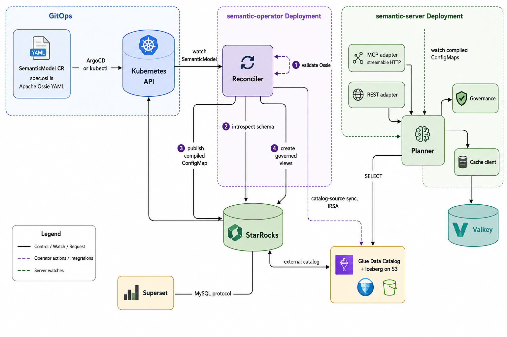

# osi-semantic-operator

**Certified business metrics → deterministic, governed SQL.** A Kubernetes operator and stateless server that turn a versioned semantic model into *exactly one* safe SQL statement per request — so AI agents, BI tools, and apps all answer the same question the same correct way.

## The problem it solves

Point an LLM at your warehouse and it writes raw SQL. Ask the same question twice and you get different queries; ask for ambiguous business logic ("customer lifetime value", "sales per employee") and it invents a plausible-but-wrong formula — a fan-out join silently multiplies the denominator and the answer is confidently incorrect. And governance bolted on *after* the query is easy to get wrong.

## What it does

You define metrics, dimensions, and joins **once** as a versioned `SemanticModel` custom resource ([Apache Ossie](https://ossie.apache.org/) YAML) under GitOps. The operator validates it against your live StarRocks/Iceberg schema, compiles it deterministically, and serves it three ways from a single planner:

- an **MCP server** for AI agents,
- a **REST API** for apps and custom UIs,
- **governed SQL views** for BI tools.

The rule that makes it safe: **the LLM never writes SQL.** It only *selects* certified metrics and dimensions; a compiler turns that selection into one StarRocks SQL statement, with row/column governance applied *before* the query is emitted — an unauthorized request fails to compile, it never leaks.

> **Naming.** This implements **Apache Ossie (incubating)**, the semantic-model standard formerly called Open Semantic Interchange (OSI). The `osi` short name survives only in code identifiers (the `semantic.osi.io` API group, `spec.osi`, and the `osictl` CLI).

## Why

- **Determinism.** An LLM writing raw SQL produces different queries for the same question, and confidently wrong queries for ambiguous ones. The planner is a compiler: the same semantic request always yields the same SQL. The LLM only selects certified metrics and dimensions; it never writes SQL.
- **Compile-time governance.** Row and column policies are applied inside the planner before SQL is emitted. An unauthorized request fails to compile. There is no post-hoc filtering to get wrong.
- **Decoupling.** Business logic (metric definitions, join graph, synonyms) lives in a versioned CR under GitOps. Physical schema lives in the Iceberg catalog. The catalog-source sync derives dataset bindings and field lists from AWS Glue, so humans maintain only metrics, joins, and synonyms.
- **StarRocks fits.** A join-graph semantic layer needs an engine that executes star-schema joins fast over lake data. StarRocks queries Iceberg through an external catalog with vectorized execution and join optimizations, speaks MySQL protocol (so BI tools connect natively), and supports logical views over external catalog tables (so governed metric views are plain views).

## Architecture


<!-- Diagram source: docs/diagrams/architecture-overview.mmd -->

Documentation:

- [docs/OVERVIEW.md](docs/OVERVIEW.md) — what this is, the gaps it fills, why to use it, and role-based onboarding.
- [docs/AUTHORING.md](docs/AUTHORING.md) — author a semantic model step by step: generate a template with `osictl derive`, then add joins, metrics, and business meaning.
- [docs/ARCHITECTURE.md](docs/ARCHITECTURE.md) — component responsibilities, request flows, the CRD lifecycle, and the governance model.
- [docs/DEVELOPER.md](docs/DEVELOPER.md) — code hierarchy, package layering, the two binaries, where engine-specific code lives, and **how to deploy & operate**.
- [docs/EXTENDING-ENGINES.md](docs/EXTENDING-ENGINES.md) — step-by-step for adding a query engine (Trino/ClickHouse/DuckDB).
- [docs/ROADMAP.md](docs/ROADMAP.md) — planned work and follow-ups.

Examples ([examples/](examples/README.md)): [examples/starrocks/retail/](examples/starrocks/retail/README.md) is the runnable reference demo (data loader, model, NL comparison, benchmark); [examples/starrocks/flights/](examples/starrocks/flights/README.md) is a second Glue-bound example adapted from the [Apache Ossie flights model](https://github.com/apache/ossie/blob/main/examples/flights.yaml). Running an example end to end is documented in its own README.

## Components

| Component | Binary | What it does |
|---|---|---|
| Operator | `cmd/manager` | Reconciles `SemanticModel` CRs: Apache Ossie validation, physical binding and drift check against live StarRocks/Iceberg schema, deterministic compile, publish to ConfigMap, governed view creation in StarRocks. |
| Semantic server | `cmd/server` | Stateless. Watches compiled-model ConfigMaps. Hosts the planner, compile-time governance, optional Valkey plan/result caches, the MCP adapter (streamable HTTP), and the REST adapter. |
| CLI | `cmd/osictl` | Validate Apache Ossie YAML offline, derive dataset stubs from a Glue database (catalog auto-derivation), wrap Ossie YAML into a CR and back (round-trip). |

The planner emits StarRocks SQL only, behind an `emitter.Dialect` interface so other engines can be added. The catalog sync is behind a `catalog.Source` interface with a Glue implementation. A MetricFlow integration point is documented but not built. See scope guardrails in [docs/ARCHITECTURE.md](docs/ARCHITECTURE.md#extension-points).

## What a request looks like

Semantic request in, one SQL statement out:

```json
{
  "model": "tpcds_retail_model",
  "metrics": ["total_sales"],
  "dimensions": ["item.i_category"],
  "filters": [{"field": "date_dim.d_year", "op": "=", "value": 2001}],
  "identity": {"role": "analyst"}
}
```

```sql
/* semantic-layer model=tpcds_retail_model version=3f2a9c1b7e4d request=7d0e1f8a... */
SELECT `item`.`i_category` AS `item.i_category`,
       SUM(`store_sales`.`ss_ext_sales_price`) AS `total_sales`
FROM `iceberg`.`osi_demo`.`store_sales` AS `store_sales`
INNER JOIN `iceberg`.`osi_demo`.`item` AS `item`
    ON `store_sales`.`ss_item_sk` = `item`.`i_item_sk`
INNER JOIN `iceberg`.`osi_demo`.`date_dim` AS `date_dim`
    ON `store_sales`.`ss_sold_date_sk` = `date_dim`.`d_date_sk`
WHERE `date_dim`.`d_year` = 2001
GROUP BY `item`.`i_category`
ORDER BY `item`.`i_category`
```

Same request, same SQL, every time. Every emitted statement carries the model name, model version, and request hash in a leading comment for traceability from StarRocks audit logs back to the semantic request.

## Quickstart

You need a Kubernetes cluster with:

- **StarRocks** (FE + BE, shared-data mode) — the only required runtime dependency. On EKS, deploy it with the [StarRocks on EKS stack](https://awslabs.github.io/data-on-eks/docs/datastacks/databases/starrocks-on-eks) from Data on EKS.
- **Valkey** — optional (plan/result caching). Enable the Valkey add-on in the same [Data on EKS](https://awslabs.github.io/data-on-eks/) stack, or skip it to run without a cache.
- **A Glue/Iceberg external catalog in StarRocks** — a one-time `CREATE EXTERNAL CATALOG` so StarRocks can read Iceberg tables on S3 through AWS Glue. This is the only manual data step; the demo **database and tables** are then created for you by `make demo-data`. Run the catalog statement once — [how](examples/starrocks/retail/README.md#1-create-the-starrocks-external-catalog-for-glueiceberg-once).

Then, from a checkout:

```bash
# 1. Build and push images to ECR (region/account from environment)
make ecr-login docker-build docker-push \
  REGISTRY=<acct>.dkr.ecr.us-west-2.amazonaws.com

# 2. Install the operator and semantic server.
#    valkey.addr is optional — omit that --set line to run without caching.
helm install semantic-operator charts/semantic-operator \
  --namespace semantic-system --create-namespace \
  --set image.repository=<acct>.dkr.ecr.us-west-2.amazonaws.com/osi-semantic-operator \
  --set image.tag=0.1.0 \
  --set starrocks.host=starrocks-fe.starrocks.svc.cluster.local \
  --set valkey.addr=valkey.valkey.svc.cluster.local:6379 \
  --set aws.region=us-west-2

# 3. Point your workstation at the cluster. The make demo-*/bench targets run
#    locally and reach StarRocks + the server over these port-forwards, so set
#    the env vars they read. (STARROCKS_HOST is required; MCP_ENDPOINT + Bedrock
#    are needed only for the NL demo and benchmark.)
kubectl -n <starrocks-ns> port-forward svc/<fe-service> 9030:9030 &
kubectl -n semantic-system port-forward svc/semantic-operator-server 8090:8090 &
export STARROCKS_HOST=127.0.0.1
export MCP_ENDPOINT=http://localhost:8090/mcp
export AWS_REGION=us-west-2
export BEDROCK_MODEL_ID=<your enabled Bedrock Claude model id>   # NL demo + bench only

# 4. Load demo data (creates Iceberg tables in Glue via StarRocks, idempotent)
make demo-data

# 5. Apply the demo semantic model (Apache Ossie TPC-DS subset)
kubectl apply -f examples/starrocks/retail/model/semanticmodel.yaml
kubectl get semanticmodels -n semantic-system   # wait for Validated/Published, Drift=False

# 6. Run the natural-language comparison (raw text-to-SQL vs semantic layer; needs an LLM)
make demo-nl QUESTION="What was total sales by category in 2001?"

# 7. Run the accuracy benchmark (needs an LLM)
make bench

# Governed views are already in StarRocks (semantic_views.*). Point any
# MySQL-protocol BI tool at them to see certified numbers — no extra setup.
```

Every endpoint, credential, and catalog name above is a Helm value or environment variable. Nothing is hardcoded. See [charts/semantic-operator/values.yaml](charts/semantic-operator/values.yaml). Deploy & operate details live in [docs/DEVELOPER.md](docs/DEVELOPER.md#deploy--operate); the full end-to-end for this demo, including the one-time StarRocks external catalog setup for Glue and troubleshooting, is [examples/starrocks/retail/README.md](examples/starrocks/retail/README.md).

> **Which LLM?** The semantic layer itself is **model- and provider-agnostic** — it exposes an MCP server and a REST API, and *never* calls an LLM. Any MCP-capable agent (Anthropic API, OpenAI, Bedrock, or a **self-hosted model on GPU** behind a serving endpoint such as vLLM/TGI/Ollama) can drive it. Only the bundled NL demo and benchmark harness (`internal/nlbench`) are wired to Amazon Bedrock's Converse API for reproducibility; point them at a different endpoint by implementing the small `Complete`/`RunToolLoop` seam in `internal/nlbench`.

## Demo: with and without the semantic layer

The retail example answers a business question two ways on the same StarRocks cluster — raw LLM text-to-SQL vs. the semantic layer — and prints SQL, results, and correctness side by side. Ambiguous metrics (`customer_lifetime_value`, `store_productivity`) are where raw text-to-SQL invents a plausible formula that differs run to run and paraphrase to paraphrase; the semantic path is certified and deterministic. The benchmark harness quantifies this: accuracy, paraphrase consistency, and hallucination rate.

See [examples/starrocks/retail/README.md](examples/starrocks/retail/README.md) for how to run it and [examples/starrocks/retail/bench/RESULTS.md](examples/starrocks/retail/bench/RESULTS.md) for results.

## Repository layout

```
api/v1alpha1/          CRD types (Apache Ossie model as Go structs)
controllers/           SemanticModel reconciler
cmd/                   manager, server, osictl binaries
internal/osi/          Apache Ossie schema validation
internal/planner/      semantic request -> logical plan -> SQL; expr/ grammar
internal/governance/   compile-time row/column/metric policies
internal/emitter/      Dialect interface; starrocks/ implementation
internal/catalog/      Source interface; glue/ implementation; derive.go
internal/cache/        Valkey plan + result caches (optional)
internal/serving/      shared query service; mcp/, rest/, views/ adapters
internal/starrocks/    MySQL-protocol client, schema introspection
internal/nlbench/      NL comparison / benchmark support
internal/observability/ tracing + metrics
charts/semantic-operator/  Helm chart (crds/, templates/, values.yaml)
examples/              use cases by engine: starrocks/retail, starrocks/flights
hack/                  build-time tool dependencies
docs/                  OVERVIEW, ARCHITECTURE, DEVELOPER, EXTENDING-ENGINES, ROADMAP
```

## License

Apache-2.0
