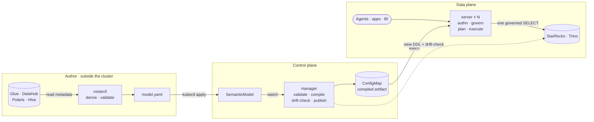

# Semantic Operator

[](LICENSE)
<!-- These badges need a public repository; uncomment when the repo goes public:
[](https://github.com/KubedAI/semantic-operator/actions/workflows/ci.yaml)
[](https://goreportcard.com/report/github.com/KubedAI/semantic-operator)
-->

**📖 Documentation: <https://kubedai.github.io/semantic-operator>**

A Kubernetes operator and server that run an [Apache Ossie](https://ossie.apache.org/)
(incubating) semantic layer on your existing data platform. You define each business
metric once, in a `SemanticModel` resource. A deterministic compiler turns every request
into exactly one governed SQL statement, so AI agents (over MCP), apps (over REST), and BI
tools (over SQL views) all compute the metric the same way. The LLM only selects certified
metrics and dimensions. It never writes SQL.

## Why

Point an LLM at a warehouse and it writes raw SQL. Measured across 30 business questions,
three phrasings each, at temperature 0:

| Path | Accuracy | Consistency across phrasings | Wrong answers |
|---|---|---|---|
| Raw text-to-SQL | 62/90 (69%) | 19/30 (63%) | 28 |
| **Semantic layer** | **87/90 (97%)** | **27/30 (90%)** | 3 |

Every raw-path miss executed without error and returned a confidently wrong number.
[Full results and method →](https://kubedai.github.io/semantic-operator/examples/benchmark-results)

## How it fits together



The operator and the server never call each other. They coordinate through the Kubernetes
API, which is why queries keep being served while the operator is upgrading.

## Quickstart

Requires a Kubernetes cluster with a query engine (StarRocks or Trino) it can reach.

```bash
helm upgrade --install semantic-operator charts/semantic-operator \
  --namespace semantic-system --create-namespace \
  --set image.repository=<acct>.dkr.ecr.<region>.amazonaws.com/semantic-operator \
  --set image.tag=<tag> \
  --set engine.type=starrocks \
  --set engine.host=<engine-host>
```

[Full quickstart, with the demo data and your first governed query →](https://kubedai.github.io/semantic-operator/start/quickstart)

## Repository layout

```
api/v1alpha1/     CRD types (Apache Ossie model as Go structs)
controllers/      SemanticModel reconciler
cmd/              manager, server, ossiectl binaries
internal/         planner, governance, emitter, dbclient, catalog, serving, cache
charts/           Helm chart
examples/         runnable examples, grouped by deployment stack
website/          documentation site (Astro + Starlight)
```

## Documentation

Everything lives on the [docs site](https://kubedai.github.io/semantic-operator). The most
useful entry points:

- [What this is](https://kubedai.github.io/semantic-operator/start/overview) and [how it works](https://kubedai.github.io/semantic-operator/start/architecture)
- [Authoring a model](https://kubedai.github.io/semantic-operator/guides/authoring)
- [Components and access](https://kubedai.github.io/semantic-operator/reference/components) — what each component needs, and what it deliberately does not
- [Adding a query engine](https://kubedai.github.io/semantic-operator/guides/extending-engines)
- [Examples](https://kubedai.github.io/semantic-operator/examples)

To run the docs locally:

```bash
make docs        # install deps and serve at http://localhost:4321
```

## Contributing

Start with the [developer guide](https://kubedai.github.io/semantic-operator/reference/developer)
for the code layout and the offline test loop (`make test` needs no cluster), and the
[roadmap](https://kubedai.github.io/semantic-operator/project/roadmap) for prioritized work.
New engine dialects, catalog sources, and a local `kind` quickstart are the best first
contributions.

## License

Apache-2.0
