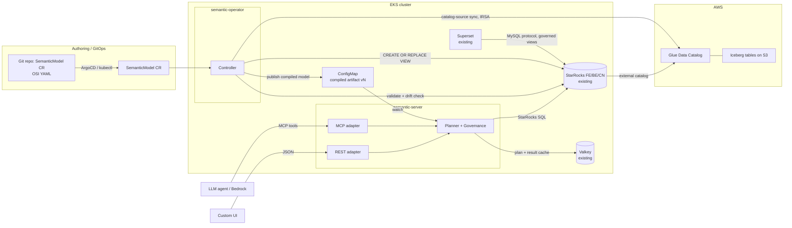

# osi-semantic-operator

A Kubernetes operator that runs an [Open Semantic Interchange (OSI)](https://github.com/open-semantic-interchange/OSI) semantic layer on Amazon EKS, on top of an existing StarRocks cluster querying Apache Iceberg tables.

You author a `SemanticModel` custom resource as OSI YAML. The operator validates it, checks its physical bindings against the live StarRocks/Iceberg schema, compiles it, and publishes it to a semantic planner. The planner turns semantic requests (metrics, dimensions, filters, time grain) into exactly one deterministic StarRocks SQL statement, with row and column governance applied at compile time. Three thin adapters serve the same planner: an MCP server for agents, a REST API for custom UIs, and governed StarRocks views for BI tools such as Apache Superset.

## Why

- **Determinism.** An LLM writing raw SQL produces different queries for the same question, and confidently wrong queries for ambiguous ones. The planner is a compiler: the same semantic request always yields the same SQL. The LLM only selects certified metrics and dimensions; it never writes SQL.
- **Compile-time governance.** Row and column policies are applied inside the planner before SQL is emitted. An unauthorized request fails to compile. There is no post-hoc filtering to get wrong.
- **Decoupling.** Business logic (metric definitions, join graph, synonyms) lives in a versioned CR under GitOps. Physical schema lives in the Iceberg catalog. The catalog-source sync derives dataset bindings and field lists from AWS Glue, so humans maintain only metrics, joins, and synonyms.
- **StarRocks fits.** A join-graph semantic layer needs an engine that executes star-schema joins fast over lake data. StarRocks queries Iceberg through an external catalog with vectorized execution and join optimizations, speaks MySQL protocol (so Superset connects natively), and supports logical views over external catalog tables (so governed metric views are plain views).

## Architecture



Component responsibilities, request flows, the CRD lifecycle, and the governance model are specified in [docs/ARCHITECTURE.md](docs/ARCHITECTURE.md). The end-to-end deploy and test procedure is in [docs/RUNBOOK.md](docs/RUNBOOK.md).

## Components

| Component | Binary | What it does |
|---|---|---|
| Operator | `cmd/manager` | Reconciles `SemanticModel` CRs: OSI validation, physical binding and drift check against live StarRocks/Iceberg schema, deterministic compile, publish to ConfigMap, governed view creation in StarRocks. |
| Semantic server | `cmd/server` | Stateless. Watches compiled-model ConfigMaps. Hosts the planner, compile-time governance, Valkey plan/result caches, the MCP adapter (streamable HTTP), and the REST adapter. |
| CLI | `cmd/osictl` | Validate OSI YAML offline, derive dataset stubs from a Glue database (catalog auto-derivation), wrap OSI YAML into a CR and back (round-trip). |

The planner emits StarRocks SQL only, behind an `emitter.Dialect` interface so other engines can be added. The catalog sync is behind a `catalog.Source` interface with a Glue implementation. A MetricFlow integration point is documented but not built. See scope guardrails in [docs/ARCHITECTURE.md](docs/ARCHITECTURE.md#extension-points).

## What a request looks like

Semantic request in, one SQL statement out:

```json
{
  "model": "tpcds_retail_model",
  "metrics": ["total_sales"],
  "dimensions": ["item.i_category"],
  "filters": [{"field": "date_dim.d_year", "op": "=", "value": 2001}],
  "identity": {"role": "analyst"}
}
```

```sql
/* semantic-layer model=tpcds_retail_model version=3f2a9c1b request=7d0e... */
SELECT `item`.`i_category` AS `item.i_category`,
       SUM(`store_sales`.`ss_ext_sales_price`) AS `total_sales`
FROM `iceberg`.`osi_demo`.`store_sales` AS `store_sales`
INNER JOIN `iceberg`.`osi_demo`.`item` AS `item`
    ON `store_sales`.`ss_item_sk` = `item`.`i_item_sk`
INNER JOIN `iceberg`.`osi_demo`.`date_dim` AS `date_dim`
    ON `store_sales`.`ss_sold_date_sk` = `date_dim`.`d_date_sk`
WHERE `date_dim`.`d_year` = 2001
GROUP BY `item`.`i_category`
ORDER BY `item`.`i_category`
```

Same request, same SQL, every time. Every emitted statement carries the model name, model version, and request hash in a leading comment for traceability from StarRocks audit logs back to the semantic request.

## Quickstart

Prerequisites: an EKS cluster with StarRocks (shared-data, external Iceberg catalog on Glue), Valkey, and Superset already running; `kubectl`, `helm`, `docker`, Go 1.24+, AWS credentials with ECR/Glue/Bedrock access.

```bash
# 1. Build and push images to ECR (region/account from environment)
make ecr-login docker-build docker-push \
  REGISTRY=<acct>.dkr.ecr.us-west-2.amazonaws.com

# 2. Install the operator, planner, and adapters
helm install semantic-operator charts/semantic-operator \
  --namespace semantic-system --create-namespace \
  --set image.repository=<acct>.dkr.ecr.us-west-2.amazonaws.com/osi-semantic-operator \
  --set image.tag=0.1.0 \
  --set starrocks.host=starrocks-fe.starrocks.svc.cluster.local \
  --set valkey.addr=valkey.valkey.svc.cluster.local:6379 \
  --set aws.region=us-west-2

# 3. Load demo data (creates Iceberg tables in Glue via StarRocks, idempotent)
make demo-data

# 4. Apply the demo semantic model (OSI TPC-DS subset)
kubectl apply -f demo/model/semanticmodel.yaml
kubectl get semanticmodels -n semantic-system   # wait for Validated/Compiled/Published

# 5. Run the natural-language comparison (raw text-to-SQL vs semantic layer)
make demo-nl QUESTION="What was total sales by category in 2001?"

# 6. Wire up Superset (governed views are already in StarRocks)
#    follow demo/superset/README.md

# 7. Run the accuracy benchmark
make bench
```

Every endpoint, credential, and catalog name above is a Helm value or environment variable. Nothing is hardcoded. See [charts/semantic-operator/values.yaml](charts/semantic-operator/values.yaml). The full copy-paste procedure, including the one-time StarRocks external catalog setup for Glue and troubleshooting, is [docs/RUNBOOK.md](docs/RUNBOOK.md).

## Demo: with and without the semantic layer

The demo loads a TPC-DS subset (`store_sales` fact, `date_dim`, `customer`, `item`, `store` dimensions) as Iceberg tables in Glue, queried through the StarRocks external catalog. The data is synthetic, deterministic (fixed seed), and demo sized, so every benchmark question has a computable ground-truth answer.

`demo/nl` answers a business question two ways using Amazon Bedrock:

1. **Without semantic layer.** The LLM sees raw `SHOW CREATE TABLE` output and writes SQL directly against StarRocks.
2. **With semantic layer.** The LLM calls the MCP tools (`list_metrics`, `list_dimensions`, `query_metric`) and the planner emits the SQL.

Both statements execute on the same StarRocks cluster and the tool prints SQL, results, and correctness side by side. Ambiguous metrics are where the raw path fails: "customer lifetime value" or "store productivity" have exact certified definitions in the model, while raw text-to-SQL invents a plausible formula that differs run to run and paraphrase to paraphrase. The benchmark in `bench/` quantifies this over ~30 questions: accuracy, consistency across paraphrases, and hallucination rate. Results: [bench/RESULTS.md](bench/RESULTS.md).

## Repository layout

```
api/v1alpha1/          CRD types (OSI model as Go structs)
controllers/           SemanticModel reconciler
internal/osi/          OSI schema validation
internal/planner/      semantic request -> logical plan
internal/governance/   compile-time row/column policies
internal/emitter/      Dialect interface; starrocks/ implementation
internal/catalog/      Source interface; glue/ implementation
internal/cache/        Valkey plan + result caches
internal/serving/      mcp/, rest/, views/ adapters
internal/starrocks/    MySQL-protocol client, schema introspection
cmd/                   manager, server, osictl
charts/semantic-operator/
demo/                  data loader, SemanticModel CR, NL comparison, Superset
bench/                 accuracy benchmark harness
docs/                  ARCHITECTURE.md, RUNBOOK.md
```

## License

Apache-2.0
