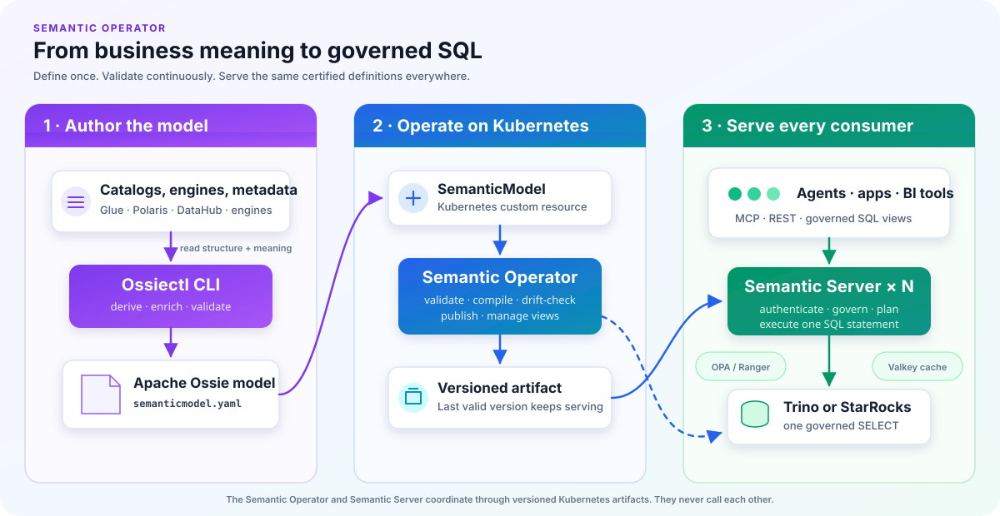

# Semantic Operator

[](LICENSE)
[](https://github.com/KubedAI/semantic-operator/actions/workflows/ci.yaml)

**📖 Documentation: <https://kubedai.github.io/semantic-operator>**

A Kubernetes operator and server that run an [Apache Ossie](https://ossie.apache.org/)
(incubating) semantic layer on your existing data platform. You define each business
metric once, in a `SemanticModel` resource. A deterministic compiler turns every request
into exactly one governed SQL statement, so AI agents (over MCP), apps (over REST), and BI
tools (over SQL views) all compute the metric the same way. The LLM only selects certified
metrics and dimensions. It never writes SQL.

## Why

Many AI agents ask an LLM to generate SQL directly from a warehouse schema. The SQL can run
successfully while using the wrong business definition. We measured both approaches across
30 business questions, with three phrasings each at temperature 0:

| Path | Accuracy | Consistency across phrasings | Wrong answers |
|---|---|---|---|
| Raw text-to-SQL | 62/90 (69%) | 19/30 (63%) | 28 |
| **Semantic layer** | **87/90 (97%)** | **27/30 (90%)** | 3 |

Every raw-path miss executed without error and returned a confidently wrong number.
[Full results and method →](https://kubedai.github.io/semantic-operator/examples/benchmark-results)

## How it fits together

<p align="center">
  
</p>

The Semantic Operator and Semantic Server never call each other. They coordinate through
the Kubernetes API, which is why queries keep being served while the operator is upgrading.

## Quickstart

Run the complete stack locally with Docker, kind, `kubectl`, Helm, Make, and the Go toolchain
from `go.mod`:

```bash
git clone https://github.com/KubedAI/semantic-operator.git
cd semantic-operator
make quickstart
```

This creates a local kind cluster, installs Trino and Semantic Operator, loads demo data,
and publishes a certified model.
[Run your first governed query →](https://kubedai.github.io/semantic-operator/start/quickstart)

## Repository layout

```
api/v1alpha1/     CRD types (Apache Ossie model as Go structs)
controllers/      SemanticModel reconciler
cmd/              manager, server, ossiectl binaries
internal/         planner, governance, emitter, dbclient, catalog, serving, cache
charts/           Helm chart
examples/         runnable examples, grouped by deployment stack
website/          documentation site (Astro + Starlight)
```

## Documentation

Everything lives on the [docs site](https://kubedai.github.io/semantic-operator). The most
useful entry points:

- [What a semantic layer is](https://kubedai.github.io/semantic-operator/start/introduction)
  and [how Semantic Operator works](https://kubedai.github.io/semantic-operator/architecture)
- [How an agent request becomes SQL](https://kubedai.github.io/semantic-operator/architecture/agent-to-sql)
- [Authoring a model](https://kubedai.github.io/semantic-operator/guides/authoring)
- [Components and access](https://kubedai.github.io/semantic-operator/architecture/access),
  including the permissions each component needs
- [Adding a query engine](https://kubedai.github.io/semantic-operator/guides/adding-an-engine)
- [Examples](https://kubedai.github.io/semantic-operator/examples)

To run the docs locally:

```bash
make docs        # install deps and serve at http://localhost:4321
```

## Contributing

Start with the [developer guide](https://kubedai.github.io/semantic-operator/guides/developing)
for the code layout and the offline test loop (`make test` needs no cluster).
[Adding a query engine](https://kubedai.github.io/semantic-operator/guides/adding-an-engine)
and [adding a catalog source](https://kubedai.github.io/semantic-operator/guides/adding-a-catalog)
describe the main extension points.

## License

Apache-2.0
