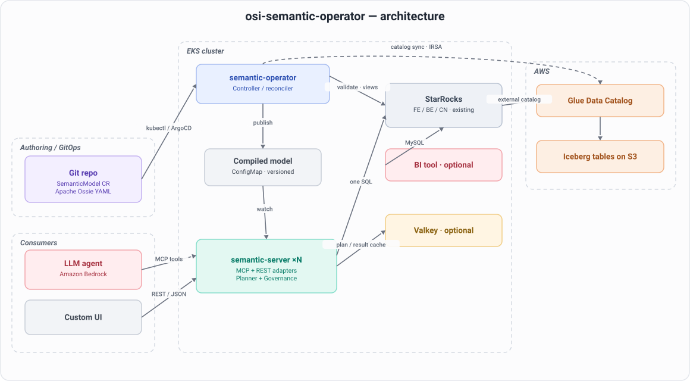

# osi-semantic-operator

A Kubernetes operator that runs an [Apache Ossie (incubating)](https://ossie.apache.org/) semantic layer on Amazon EKS, on top of an existing StarRocks cluster querying Apache Iceberg tables.

> Apache Ossie is the vendor-neutral semantic-model standard formerly known as **Open Semantic Interchange (OSI)**; it entered the Apache Incubator in July 2026. The YAML spec is unchanged. Code identifiers in this repo retain the historical `osi` short name (the `semantic.osi.io` API group, the `spec.osi` block, and the `osictl` CLI) so existing deployments keep working.

You author a `SemanticModel` custom resource as Apache Ossie YAML. The operator validates it, checks its physical bindings against the live StarRocks/Iceberg schema, compiles it, and publishes it to a semantic planner. The planner turns semantic requests (metrics, dimensions, filters, time grain) into exactly one deterministic StarRocks SQL statement, with row and column governance applied at compile time. Three thin adapters serve the same planner: an MCP server for agents, a REST API for custom UIs, and governed StarRocks views for BI tools such as Apache Superset.

## Why

- **Determinism.** An LLM writing raw SQL produces different queries for the same question, and confidently wrong queries for ambiguous ones. The planner is a compiler: the same semantic request always yields the same SQL. The LLM only selects certified metrics and dimensions; it never writes SQL.
- **Compile-time governance.** Row and column policies are applied inside the planner before SQL is emitted. An unauthorized request fails to compile. There is no post-hoc filtering to get wrong.
- **Decoupling.** Business logic (metric definitions, join graph, synonyms) lives in a versioned CR under GitOps. Physical schema lives in the Iceberg catalog. The catalog-source sync derives dataset bindings and field lists from AWS Glue, so humans maintain only metrics, joins, and synonyms.
- **StarRocks fits.** A join-graph semantic layer needs an engine that executes star-schema joins fast over lake data. StarRocks queries Iceberg through an external catalog with vectorized execution and join optimizations, speaks MySQL protocol (so Superset connects natively), and supports logical views over external catalog tables (so governed metric views are plain views).

## Architecture


<!-- Diagram source: docs/diagrams/architecture-overview.mmd -->

Documentation:

- [docs/OVERVIEW.md](docs/OVERVIEW.md) — what this is, the gaps it fills, why to use it, and role-based onboarding.
- [docs/ARCHITECTURE.md](docs/ARCHITECTURE.md) — component responsibilities, request flows, the CRD lifecycle, and the governance model.
- [docs/DEVELOPER.md](docs/DEVELOPER.md) — code hierarchy, package layering, the two binaries, where engine-specific code lives, and **how to deploy & operate**.
- [docs/EXTENDING-ENGINES.md](docs/EXTENDING-ENGINES.md) — step-by-step for adding a query engine (Trino/ClickHouse/DuckDB).
- [docs/ROADMAP.md](docs/ROADMAP.md) — planned work and follow-ups.

Examples ([examples/](examples/README.md)): [examples/starrocks/retail/](examples/starrocks/retail/README.md) is the runnable reference demo (data loader, model, NL comparison, benchmark, Superset); [examples/starrocks/flights/](examples/starrocks/flights/README.md) is a second Glue-bound example adapted from the [Apache Ossie flights model](https://github.com/apache/ossie/blob/main/examples/flights.yaml). Running an example end to end is documented in its own README.

## Components

| Component | Binary | What it does |
|---|---|---|
| Operator | `cmd/manager` | Reconciles `SemanticModel` CRs: Apache Ossie validation, physical binding and drift check against live StarRocks/Iceberg schema, deterministic compile, publish to ConfigMap, governed view creation in StarRocks. |
| Semantic server | `cmd/server` | Stateless. Watches compiled-model ConfigMaps. Hosts the planner, compile-time governance, optional Valkey plan/result caches, the MCP adapter (streamable HTTP), and the REST adapter. |
| CLI | `cmd/osictl` | Validate Apache Ossie YAML offline, derive dataset stubs from a Glue database (catalog auto-derivation), wrap Ossie YAML into a CR and back (round-trip). |

The planner emits StarRocks SQL only, behind an `emitter.Dialect` interface so other engines can be added. The catalog sync is behind a `catalog.Source` interface with a Glue implementation. A MetricFlow integration point is documented but not built. See scope guardrails in [docs/ARCHITECTURE.md](docs/ARCHITECTURE.md#extension-points).

## What a request looks like

Semantic request in, one SQL statement out:

```json
{
  "model": "tpcds_retail_model",
  "metrics": ["total_sales"],
  "dimensions": ["item.i_category"],
  "filters": [{"field": "date_dim.d_year", "op": "=", "value": 2001}],
  "identity": {"role": "analyst"}
}
```

```sql
/* semantic-layer model=tpcds_retail_model version=3f2a9c1b7e4d request=7d0e1f8a... */
SELECT `item`.`i_category` AS `item.i_category`,
       SUM(`store_sales`.`ss_ext_sales_price`) AS `total_sales`
FROM `iceberg`.`osi_demo`.`store_sales` AS `store_sales`
INNER JOIN `iceberg`.`osi_demo`.`item` AS `item`
    ON `store_sales`.`ss_item_sk` = `item`.`i_item_sk`
INNER JOIN `iceberg`.`osi_demo`.`date_dim` AS `date_dim`
    ON `store_sales`.`ss_sold_date_sk` = `date_dim`.`d_date_sk`
WHERE `date_dim`.`d_year` = 2001
GROUP BY `item`.`i_category`
ORDER BY `item`.`i_category`
```

Same request, same SQL, every time. Every emitted statement carries the model name, model version, and request hash in a leading comment for traceability from StarRocks audit logs back to the semantic request.

## Quickstart

Prerequisites: a Kubernetes/EKS cluster with an **existing StarRocks** cluster (shared-data, external Iceberg catalog on Glue) — the only required runtime dependency besides Kubernetes. **Valkey** (caching) and **Superset** (BI views) are optional. Tooling: `kubectl`, `helm`, `docker`, Go 1.26+, AWS credentials with ECR/Glue/S3 access (Bedrock only for the NL demo).

```bash
# 1. Build and push images to ECR (region/account from environment)
make ecr-login docker-build docker-push \
  REGISTRY=<acct>.dkr.ecr.us-west-2.amazonaws.com

# 2. Install the operator and semantic server
helm install semantic-operator charts/semantic-operator \
  --namespace semantic-system --create-namespace \
  --set image.repository=<acct>.dkr.ecr.us-west-2.amazonaws.com/osi-semantic-operator \
  --set image.tag=0.1.0 \
  --set starrocks.host=starrocks-fe.starrocks.svc.cluster.local \
  --set valkey.addr=valkey.valkey.svc.cluster.local:6379 \   # optional; omit to disable caching
  --set aws.region=us-west-2

# 3. Load demo data (creates Iceberg tables in Glue via StarRocks, idempotent)
make demo-data

# 4. Apply the demo semantic model (Apache Ossie TPC-DS subset)
kubectl apply -f examples/starrocks/retail/model/semanticmodel.yaml
kubectl get semanticmodels -n semantic-system   # wait for Validated/Compiled/Published

# 5. Run the natural-language comparison (raw text-to-SQL vs semantic layer)
make demo-nl QUESTION="What was total sales by category in 2001?"

# 6. (Optional) Wire up Superset — governed views are already in StarRocks
#    follow examples/starrocks/retail/superset/README.md

# 7. Run the accuracy benchmark
make bench
```

Every endpoint, credential, and catalog name above is a Helm value or environment variable. Nothing is hardcoded. See [charts/semantic-operator/values.yaml](charts/semantic-operator/values.yaml). Deploy & operate details live in [docs/DEVELOPER.md](docs/DEVELOPER.md#deploy--operate); the full end-to-end for this demo, including the one-time StarRocks external catalog setup for Glue and troubleshooting, is [examples/starrocks/retail/README.md](examples/starrocks/retail/README.md).

## Demo: with and without the semantic layer

The retail example answers a business question two ways on the same StarRocks cluster — raw LLM text-to-SQL vs. the semantic layer — and prints SQL, results, and correctness side by side. Ambiguous metrics (`customer_lifetime_value`, `store_productivity`) are where raw text-to-SQL invents a plausible formula that differs run to run and paraphrase to paraphrase; the semantic path is certified and deterministic. The benchmark harness quantifies this: accuracy, paraphrase consistency, and hallucination rate.

See [examples/starrocks/retail/README.md](examples/starrocks/retail/README.md) for how to run it and [examples/starrocks/retail/bench/RESULTS.md](examples/starrocks/retail/bench/RESULTS.md) for results.

## Repository layout

```
api/v1alpha1/          CRD types (Apache Ossie model as Go structs)
controllers/           SemanticModel reconciler
cmd/                   manager, server, osictl binaries
internal/osi/          Apache Ossie schema validation
internal/planner/      semantic request -> logical plan -> SQL; expr/ grammar
internal/governance/   compile-time row/column/metric policies
internal/emitter/      Dialect interface; starrocks/ implementation
internal/catalog/      Source interface; glue/ implementation; derive.go
internal/cache/        Valkey plan + result caches (optional)
internal/serving/      shared query service; mcp/, rest/, views/ adapters
internal/starrocks/    MySQL-protocol client, schema introspection
internal/nlbench/      NL comparison / benchmark support
internal/observability/ tracing + metrics
charts/semantic-operator/  Helm chart (crds/, templates/, values.yaml)
examples/              use cases by engine: starrocks/retail, starrocks/flights
hack/                  build-time tool dependencies
docs/                  OVERVIEW, ARCHITECTURE, DEVELOPER, EXTENDING-ENGINES, ROADMAP
```

## License

Apache-2.0
