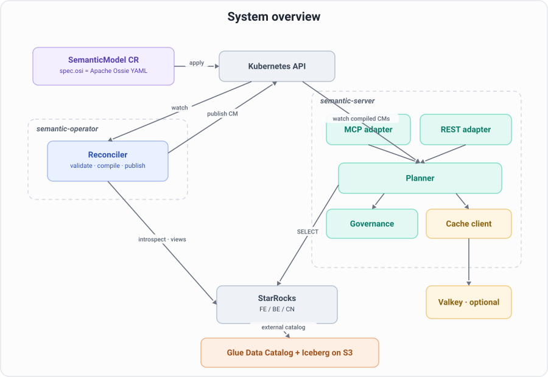
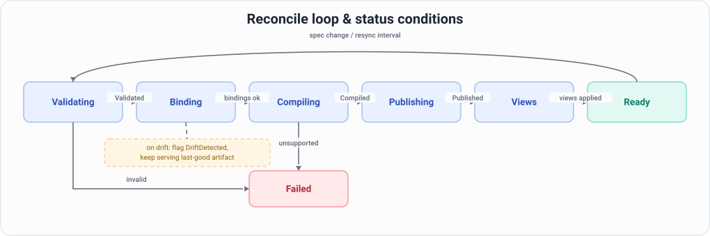
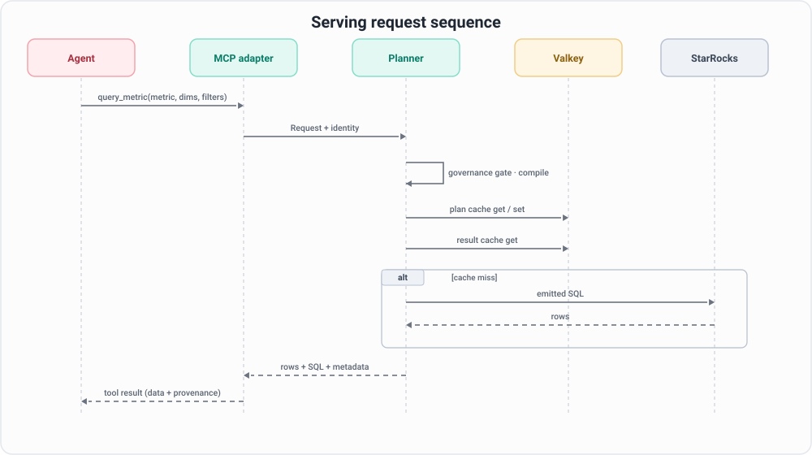

# Architecture

This document is the build spec. The code implements what is written here; if the code and this document disagree, fix one of them.

> Naming: this operator implements **Apache Ossie (incubating)**, the semantic-model standard formerly known as Open Semantic Interchange (OSI). Prose below says "Apache Ossie" or "Ossie"; code identifiers keep the historical `osi` short name — the `semantic.osi.io` API group, the `spec.osi` block, `internal/osi`, and the `osictl` CLI — so existing deployments are unaffected.

## System overview


<!-- Diagram source: docs/diagrams/system-overview.mmd -->

Two deployables, one CLI:

- **semantic-operator** (`cmd/manager`): controller-runtime manager. Owns the write path: CR validation, schema drift detection, compilation, artifact publication, governed view DDL.
- **semantic-server** (`cmd/server`): stateless serving. Owns the read path: MCP and REST adapters over a shared planner with governance and Valkey caching. Scales horizontally; all state is in ConfigMaps (compiled models) and Valkey (caches).
- **osictl** (`cmd/osictl`): offline validation, Glue-based model derivation, Apache Ossie YAML to CR wrapping and unwrapping.

The split matters for GitOps: the operator is the only writer, reconciliation is level-triggered and idempotent, and the server never mutates anything, so ArgoCD can own the CRs and nothing fights it.

## CRD: semantic.osi.io/v1alpha1 SemanticModel

The spec has three sections. `osi` is the Apache Ossie semantic model, verbatim. `governance` and `views` are operator extensions that Ossie does not define, kept outside the `osi` block so the Ossie document round-trips byte-for-byte through `osictl`.

```yaml
apiVersion: semantic.osi.io/v1alpha1
kind: SemanticModel
metadata:
  name: tpcds-retail
spec:
  connection:                    # which StarRocks external catalog the sources live in
    catalog: iceberg             # StarRocks external catalog name (Helm default, overridable per CR)
    database: osi_demo
  osi:                           # Apache Ossie (OSI v0.2) semantic_model entry, unmodified structure
    name: tpcds_retail_model
    description: ...
    ai_context: {...}
    datasets: [...]              # name, source, primary_key, fields (expression dialects), ai_context
    relationships: [...]         # from/to, from_columns/to_columns
    metrics: [...]               # name, expression.dialects[].expression, ai_context
  governance:
    defaultRole: analyst         # role assumed when adapters pass no identity
    roles:
      - name: analyst
        allowMetrics: ["*"]
        denyFields: ["customer.c_email_address"]
        rowFilters:
          - dataset: store
            predicate: "s_state = 'TX'"
      - name: admin
        allowMetrics: ["*"]
  views:                         # governed metric views materialized in StarRocks for BI
    - name: sales_by_category_year
      metrics: [total_sales, total_profit]
      dimensions: [item.i_category, date_dim.d_year]
      role: admin                # views are compiled under a role like any other request
  catalogSync:
    enabled: false               # optional: refresh dataset fields from Glue on reconcile
    source: glue
status:
  modelVersion: 3f2a9c1b7e4d    # sha256(normalized spec)[:12], bumps on any spec change
  observedGeneration: 4
  publishedConfigMap: sm-tpcds-retail-compiled   # "sm-" + CR name + "-compiled"
  conditions: [Validated, Compiled, Published, DriftDetected, ViewsReady]
```

`dataset.source` in Apache Ossie is `db.schema.table` or a bare table name. The operator resolves it against `spec.connection`: a bare name becomes `<catalog>.<database>.<table>`; a qualified name is used as-is. This keeps the Ossie document portable while the CR pins the physical binding.

### Reconcile loop and status conditions


<!-- Diagram source: docs/diagrams/reconcile-loop.mmd -->

1. **Validate** (`internal/osi`): structural validation of the Apache Ossie block: unique names, relationships reference existing datasets and columns, metric expressions parse under the supported grammar, at least one `ANSI_SQL` (or `STARROCKS`) dialect per expression. Sets `Validated`.
2. **Bind and drift-check** (`internal/starrocks` + `internal/catalog`): for every dataset, `DESC <catalog>.<db>.<table>` against live StarRocks. Missing table or missing referenced column sets `DriftDetected=True` with per-dataset detail in the message and stops publication of the new version; the previously published artifact keeps serving. Extra physical columns are not drift.
3. **Compile** (`planner.Compile` in `internal/planner`): parse every metric into a typed AST (see planner), resolve the join graph, freeze everything into a `CompiledModel` JSON artifact. Compilation is pure: no I/O, same spec in, same artifact out. Sets `Compiled`.
4. **Publish**: write the artifact to a ConfigMap owned by the CR, labeled `semantic.osi.io/model=<name>`, `semantic.osi.io/version=<modelVersion>`. Sets `Published`. The server's informer picks it up within seconds. Because the version is content-addressed, replaying the same spec is a no-op.
5. **Views** (`internal/serving/views`): each `spec.views` entry is compiled through the same planner under its declared role and applied as `CREATE OR REPLACE VIEW <viewDatabase>.<name>` in the StarRocks default catalog (views over external catalog tables are supported by StarRocks). Views removed from the spec are dropped (the operator tracks view names it created in an annotation).

Deletion uses a finalizer to drop the operator-created views, then the owned ConfigMap is garbage-collected by Kubernetes.

## Planner

`internal/planner`. Input: a `Request` (model, metrics, dimensions, filters, optional time grain, identity). Output: exactly one SQL string plus plan metadata. The planner is deterministic by construction: all iteration is over sorted or spec-ordered slices, and the output is a pure function of (compiled model, request, identity roles).

### Supported subset

- Metric aggregations: `SUM`, `COUNT`, `COUNT(DISTINCT ...)`, `AVG`, `MIN`, `MAX` over a `dataset.field` reference or a scalar expression of one dataset's fields.
- Ratio metrics: `<agg term> / <agg term>`, with or without `NULLIF(denominator, 0)`; the emitter always wraps the denominator in `NULLIF(..., 0)`.
- Joins: `INNER` (default) and `LEFT`, derived from Apache Ossie relationships. The join graph must be a tree rooted at fact datasets (star/snowflake); cycles are a validation error.
- Dimensions: any dataset field, including computed expressions.
- Filters: `=, !=, <, <=, >, >=, IN, NOT IN, BETWEEN, LIKE` against dataset fields, values parameterized through the emitter's literal encoder.
- Time grain: `day, week, month, quarter, year` applied as `DATE_TRUNC('<grain>', <time field>)` to the model's time dimension (fields with `dimension.is_time: true`).

The metric expression grammar (`internal/planner/expr`) is intentionally small: `Ratio := Term ('/' Term)? ; Term := Agg '(' ['DISTINCT'] Scalar ')' | 'NULLIF(' Term ',' number ')'`, where `Agg` is one of `SUM COUNT AVG MIN MAX` and `Scalar` is a SQL scalar expression whose column references are `dataset.field`. Anything outside the grammar fails validation at reconcile time, not at query time.

### Planning algorithm

1. Resolve requested metric and dimension names against the compiled model (synonyms are not resolved here; that is the LLM's job via `ai_context`).
2. **Governance gate** (see below). Fails compilation on violation.
3. Collect required datasets: every dataset referenced by metric terms, dimensions, filters, and row-filter predicates.
4. Choose the root: the dataset that is on the `from` side of relationships covering all required datasets (the fact table in a star schema). Compute join paths by BFS over the relationship tree; visit order is the spec order of relationships, so path choice is stable.
5. Attach row-filter predicates from governance as WHERE conjuncts (they may pull in extra joins, which repeat step 4).
6. Build the logical plan: joins, WHERE, GROUP BY (all non-aggregate select items), aggregate select items, ORDER BY (dimensions in request order, for stable output), optional LIMIT.
7. Emit through `emitter.Dialect`. The StarRocks emitter quotes every identifier with backticks, renders literals safely (no string interpolation of user filter values without escaping), and prefixes the statement with `/* semantic-layer model=<m> version=<v> request=<sha> */`.

### Ratio metrics and fan-out

Ratio metrics whose numerator and denominator aggregate different datasets (for example `SUM(store_sales.ss_ext_sales_price) / NULLIF(SUM(store.s_number_employees), 0)`) are subject to join fan-out: summing an employee count over a fact-grain join multiplies it by row count. The planner compiles each side of a ratio as its own aggregation subquery over the same join tree and dimension set, then joins the two subqueries on the dimension columns. This is the textbook reason a semantic layer beats raw text-to-SQL, and it is exactly the class of query LLMs get wrong; `store_productivity` in the demo exists to show it.

`COUNT(DISTINCT dim.pk)` style terms (as in `customer_lifetime_value`) are fan-out safe by construction and compile in the single-pass plan.

## Governance

`internal/governance`, invoked by the planner before any SQL exists.

- Identity is a `{role, claims}` object. Adapters pass it explicitly: REST via the `X-Semantic-Role` header (deployments should put an authenticating proxy in front; the server trusts the header by design and documents it), MCP via per-request tool argument or server-level default. Absent identity gets `spec.governance.defaultRole`.
- **Metric ACL**: `allowMetrics` globs. Requesting a metric outside the allowlist is a compile error (`ErrUnauthorized`), not an empty result.
- **Column policy**: `denyFields` lists `dataset.field`. A denied field used as a dimension or filter is a compile error. A denied field inside a requested metric's expression is a compile error too: you cannot read a forbidden column through an aggregate.
- **Row policy**: `rowFilters` predicates are parsed with the same field-reference resolution as user filters and conjoined into WHERE. Because they are applied during planning, they participate in join resolution and appear in the emitted SQL; there is no post-processing step that can be skipped.

Governance is part of the cache key, so a cached plan can never leak across roles.

## Caching

`internal/cache`, backed by the existing Valkey (go-redis client, works against any Redis-protocol endpoint).

- **Plan cache**: key `plan:<model>:<modelVersion>:<sha256(canonical request + sorted roles)>`, value is the compiled SQL and plan metadata. Long TTL; the modelVersion segment makes stale entries unreachable after a model change.
- **Result cache**: key `result:<model>:<modelVersion>:<sha256(SQL)>`, value is the JSON result set. Short TTL (Helm value, default 60s). Keyed on the governed SQL, which already embeds row filters, so results are role-safe.
- Cache misses or a down Valkey degrade to compute-and-query; caching is an optimization, never a correctness dependency.

## Catalog auto-derivation

`internal/catalog` defines:

```go
type Source interface {
    ListTables(ctx, database) ([]Table, error)   // Table: name, columns (name, type), parameters
}
```

`internal/catalog/glue` implements it with the AWS SDK (IRSA in-cluster). Two consumers:

- `osictl derive -database osi_demo > model.yaml`: generates Apache Ossie dataset stubs (source, fields with ANSI_SQL expressions, inferred `is_time` for date/timestamp columns) and candidate relationships. Glue rarely carries real foreign keys, so inference is convention-based: a fact column `x_sk` whose name suffix matches another table's single-column primary-key-like column (`<prefix>_sk`) becomes a candidate join, emitted commented-out for a human to confirm. Humans then maintain only metrics, joins, and synonyms; field lists are regenerated.
- Controller resync (`spec.catalogSync.enabled`): refreshes dataset field lists from Glue on a timer, so new physical columns become available as dimensions without hand-editing. Metrics and relationships are never auto-modified.

Drift detection is separate from derivation and always on: it introspects through StarRocks (`DESC`), because what matters at query time is what StarRocks can see.

## Serving adapters

All three consumers hit the same planner and governance. None of them contains query logic.


<!-- Diagram source: docs/diagrams/serving-sequence.mmd -->

- **MCP** (`internal/serving/mcp`, official `modelcontextprotocol/go-sdk`, streamable HTTP, stateless): tools `list_metrics`, `list_dimensions` (both return names, descriptions, and `ai_context` synonyms so the LLM can ground user vocabulary), `query_metric(metric, dimensions?, filters?, grain?, limit?)`. Tool results include the emitted SQL for transparency.
- **REST** (`internal/serving/rest`): `GET /v1/models`, `GET /v1/models/{m}/metrics`, `GET /v1/models/{m}/dimensions`, `POST /v1/models/{m}/query`, `POST /v1/models/{m}/sql` (dry-run: returns SQL without executing). JSON in and out.
- **BI views** (`internal/serving/views`, executed by the operator): each `spec.views` entry becomes a StarRocks logical view whose body is planner output. Any BI tool connects to StarRocks over MySQL protocol and sees `semantic_views.sales_by_category_year` as a table of certified numbers. Analysts cannot mis-aggregate a ratio metric because the view already computed it.

## Observability

- Structured logging: controller-runtime zap in the operator, `log/slog` JSON in the server, request-scoped fields (model, version, request hash, role).
- Prometheus: `/metrics` on both binaries. Server counters and histograms: `semantic_requests_total{adapter,model,outcome}`, `semantic_plan_cache_hits_total`, `semantic_result_cache_hits_total`, `semantic_starrocks_query_duration_seconds`. Operator: reconcile counters via controller-runtime defaults plus `semantic_drift_detected{model}` gauge.
- OpenTelemetry traces (OTLP endpoint via env, off when unset): spans for plan, cache, execute; the emitted SQL comment carries model, version, and request hash, so a StarRocks audit log line joins back to a trace.

## Demo and benchmark design

Goal: show that the same LLM answering the same business questions is measurably more accurate and more consistent through the semantic layer than through raw text-to-SQL.

- **Data**: synthetic TPC-DS subset (5 tables), deterministic seed, roughly 200k fact rows, written as Iceberg tables in Glue by executing DDL and batched INSERTs through StarRocks itself (StarRocks can create and insert into Iceberg external catalog tables). No Spark dependency. Idempotent: the loader checks row counts and skips completed tables.
- **Model**: `examples/starrocks/retail/model/semanticmodel.yaml`, adapted from the Apache Ossie TPC-DS example, with `total_sales`, `total_profit`, `customer_lifetime_value`, `store_productivity`, `sales_by_brand`, plus governance (analyst role denied `customer.c_email_address`, row-filtered to one state) and BI views.
- **NL comparison** (`examples/starrocks/retail/nl`, Go, Bedrock Converse API): path A gives the LLM `SHOW CREATE TABLE` output and asks for StarRocks SQL; path B gives the LLM the MCP tools. Both execute; the CLI prints SQL, rows, and, when the question is in the benchmark set, ground truth. The interesting failures are ambiguous metrics: CLV (per what? distinct buyers or all customers?), store productivity (fan-out doubles employee counts), profit vs revenue confusion.
- **Benchmark** (`examples/starrocks/retail/bench/`): ~30 questions in `questions.yaml`, each with a ground-truth SQL (hand-written, reviewed) and 2 paraphrases. The harness runs each phrasing through both paths N times, compares numeric results within tolerance, and reports per-path accuracy, cross-paraphrase consistency, and hallucination rate (nonexistent columns/tables referenced, or query errors). Output is a markdown table; reproducible given the same model id and temperature 0.

## Extension points

Deliberately built as interfaces, deliberately not built out:

- `emitter.Dialect`: add Trino/ClickHouse/DuckDB by implementing identifier quoting, literal rendering, and DATE_TRUNC mapping. Only `starrocks` ships. Step-by-step guide: [EXTENDING-ENGINES.md](EXTENDING-ENGINES.md).
- `catalog.Source`: add Unity/Polaris/Hive by implementing `ListTables`. Only `glue` ships.
- Planner boundary: `planner.Planner` is an interface taking `(CompiledModel, Request)` and returning `(Plan, SQL)`. A MetricFlow-backed implementation could replace the built-in compiler behind the same MCP/REST/views adapters. Not built.
- Not in scope: full MetricFlow semantics (multi-hop metrics, cumulative metrics, saved queries), multi-engine federation, a BI tool.
